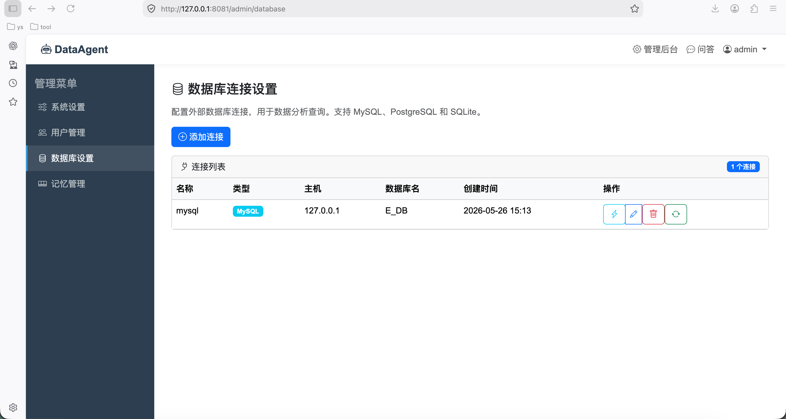

# 简单用数据库

基于大语言模型（LLM）的数据分析智能体，能够理解复杂的业务逻辑，主动探查数据库，执行多步推理，并生成可操作的见解。支持自然语言交互，自动生成 SQL、执行查询、导出多格式报告。

**核心特性：**
- 🧠 **智能决策中枢**：任务规划、反思修正、长短记忆管理
- 🔧 **执行与工具层**：Text-to-SQL（骨架+插槽）、Python 沙箱、知识图谱
- 📊 **数据与知识层**：企业知识图谱、数据血缘、元数据管理
- 🎛️ **管理后台**：LLM 配置、用户管理、数据库连接、记忆管理
- 💬 **问答系统**：多轮对话、思维链可视化、Markdown 渲染、文件下载

---

## 功能概览

- **任务规划**：自动拆解复杂分析需求为有序步骤（知识检索 → SQL 生成 → 代码执行）
- **SQL 生成**：基于“骨架+插槽”策略，避免 LLM 幻觉，生成安全可靠的 SQL
- **反思修正**：SQL 执行出错时自动分析原因并修正（最多 3 轮）
- **记忆系统**：
  - 短期记忆：保留最近 N 轮对话上下文
  - 长期记忆：向量化存储用户偏好、分析框架、业务术语
- **多格式导出**：查询结果可导出为 Excel、HTML、Word、PPT
- **代码执行器**：安全沙箱执行 Python 代码，支持统计分析与图表生成
- **知识图谱**：自动同步目标数据库元数据，管理表/字段/指标口径
- **权限管理**：管理员/普通用户角色，登录验证码，会话超时保护
- **LLM 灵活配置**：支持 OpenAI API 或 Ollama 本地模型，动态切换并测试
- **详细日志**：记录所有关键操作，方便审计与调试

---

## 技术架构

```
用户提问 → 任务规划器 → 执行引擎 → 最终答案
               ↓            ↓
         知识检索/记忆   SQL生成/代码执行
               ↓            ↓
         知识图谱/向量库  数据库/沙箱
```

- **Web 框架**：Flask + Jinja2 + Bootstrap 5
- **数据库**：SQLite（系统数据），支持 MySQL/PostgreSQL 作为分析数据源
- **LLM 交互**：通过统一接口支持 OpenAI API 和 Ollama 本地模型
- **向量检索**：用于长期记忆相似度搜索（可选）
- **文件生成**：openpyxl、python-docx、python-pptx

---

## 快速开始

### 环境要求
- Python 3.10+
- 可选：Ollama（本地模型）或 OpenAI API Key

### 安装依赖
```bash
git clone https://github.com/yourname/DataAgent.git
cd DataAgent
pip install -r requirements.txt
```

### 配置
编辑 `config.py` 或设置环境变量，主要配置项：
- `SECRET_KEY`：应用密钥
- `LLM_MODE`：`api` 或 `ollama`
- `LLM_API_KEY`：API 模式下的密钥
- `OLLAMA_BASE_URL`：Ollama 服务地址

更多动态配置（温度、记忆参数等）可在登录后管理后台调整。

### 初始化数据库并运行
```bash
python app.py
```
首次启动会自动创建 `data/app.db` 并生成默认管理员账户：
- 用户名：`admin`
- 密码：`admin123`（建议登录后立即修改）

访问 `http://127.0.0.1:8081` 开始使用。

---

## 使用指南

### 1. 登录
访问首页自动跳转登录页，输入验证码即可登录。默认管理员账户可进入管理后台。

### 2. 配置数据源
进入 `管理后台 → 数据库设置`，添加分析目标数据库（支持 MySQL、PostgreSQL、SQLite），测试连接并**同步元数据**，将表结构导入知识图谱。


### 3. 问答分析
在 `问答` 页面输入自然语言问题，例如：
- “查询上个月销售额最高的10个产品”
- “分析近一年客户复购率趋势”
系统会自动拆解任务、检索表结构、生成 SQL、执行查询，并以 Markdown 展示结果，同时提供 Excel 下载。

点击思维链可查看任务执行细节。

### 4. 记忆管理
管理员可在 `记忆管理` 中查看、搜索或手动添加长期记忆。普通用户通过对话自动学习业务术语（需要启用自动学习功能）。

### 5. 系统设置
调整 LLM 模式（API/Ollama）、温度、记忆轮数等参数，修改后即时生效。

---

## 项目结构

```
├── app.py                 # 应用入口
├── config.py              # 配置文件
├── models.py              # 数据模型定义
├── auth.py                # 登录、验证码、修改密码
├── admin.py               # 管理后台（设置/用户/数据库/记忆）
├── chat.py                # 问答核心流程
├── llm_client.py          # LLM 统一接口（API & Ollama）
├── task_planner.py        # 任务规划与分解
├── reflection.py          # SQL 错误反思修正
├── memory_manager.py      # 短/长期记忆管理
├── text_to_sql.py         # SQL 生成（骨架+插槽）
├── code_executor.py       # 沙箱代码执行器
├── knowledge_graph.py     # 企业知识图谱
├── data_lineage.py        # 数据血缘追溯
├── output_generator.py    # 多格式报告生成
├── utils.py               # 工具函数（验证码、元数据同步）
├── requirements.txt       # 依赖清单
├── templates/             # 前端页面模板
├── static/                # 静态资源（CSS、JS、输出文件）
└── data/                  # 本地数据库存储
```

---

## 扩展开发

- **新增 SQL 模板**：在 `text_to_sql.py` 的 `SQL_TEMPLATES` 中添加模式，并更新提示词和填充逻辑。
- **集成其他 LLM**：在 `llm_client.py` 中继承 `BaseLLMBackend` 实现新后端。
- **增加分析工具**：在 `task_planner.py` 中注册新工具，并在 `chat.py` 的执行循环中添加分支。
- **自定义记忆**：修改 `memory_manager.py` 添加记忆类型，或通过管理页面手动插入。

---

## 常见问题

**Q：知识图谱为空，SQL 生成失败？**  
A：请先在“数据库设置”中同步元数据，确保表结构已导入。

**Q：Ollama 请求超时？**  
A：增大 `llm_client.py` 中 Ollama 的超时时间，或使用更轻量的模型。

**Q：如何修改系统提示词？**  
A：在“系统设置”中直接编辑“系统提示词”文本框并保存。
